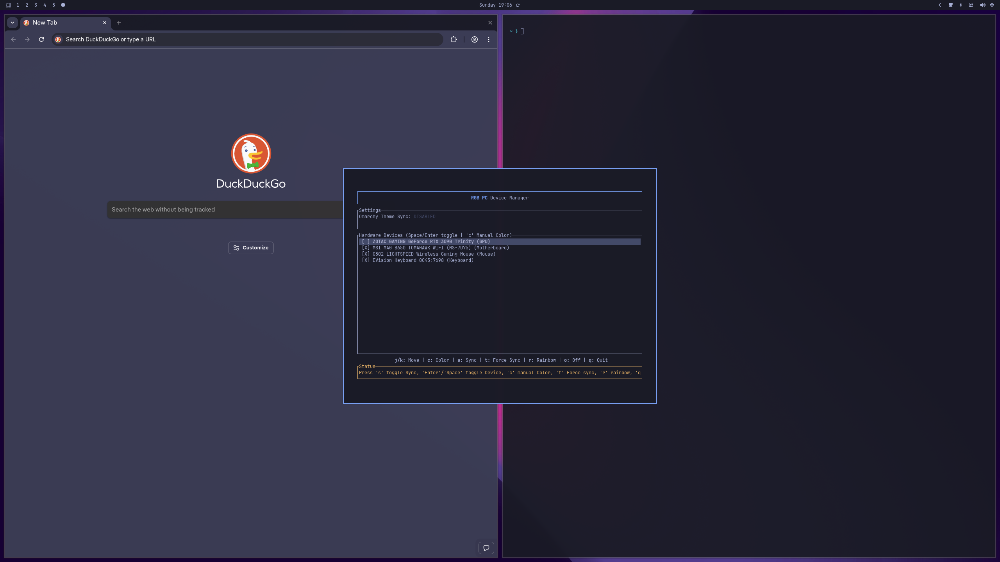

# RGBPC

A TUI application for managing your PC's RGB lighting via OpenRGB. Control all your devices, apply colors, and keep your setup looking clean — right from the terminal.

## Features

- **Device Management:** Auto-detects all OpenRGB-compatible RGB controllers. Easily enable or disable individual devices (useful for sensitive hardware like certain GPUs).
- **Manual Color Control:** Pick from a built-in palette or enter any custom HEX color, applied instantly to all enabled devices.
- **Rainbow Mode:** One key to set all enabled devices to a rainbow/spectrum cycle effect.
- **Fail-Safe Compatibility:** Tries multiple OpenRGB modes (`Direct`, `Static`, zone resizing) to maximize hardware compatibility.
- **Startup Restore:** Optionally restore the whole remembered device setup at login with a one-shot startup command, even if you only changed one device last time.
- **Omarchy Theme Sync** _(Omarchy users only)_: Automatically reads your `colors.toml` and syncs your current theme's accent color to all enabled devices. Includes a one-click hook installer for `~/.config/omarchy/hooks/theme-set`.

## Installation

### From AUR (Recommended)

```bash
yay -S rgbpc
```

### Build from source

```bash
git clone https://github.com/Zeus-Deus/rgbpc.git
cd rgbpc
cargo build --release
sudo cp target/release/rgbpc /usr/local/bin/
sudo cp assets/rgbpc.desktop /usr/share/applications/
```

## Usage

Launch `rgbpc` from your terminal or application launcher. Use `j`/`k` to navigate devices, `Space`/`Enter` to toggle a device on or off for manual bulk actions, `a` to toggle startup restore, `c` to pick a color for all enabled devices, `o` to turn all enabled devices off, `r` for rainbow mode, and `q` to quit.

If you are on [Omarchy](https://omarchy.org), the app will also show a **Settings** panel where you can enable automatic theme sync — colors will update across your hardware whenever you switch themes. When both startup restore and Omarchy sync are enabled, login restore uses the current Omarchy theme instead of the last manual color.

For non-interactive use, `rgbpc --restore-last` runs the same startup restore path used by the autostart entry. Startup restore reapplies each remembered device's own last state instead of one shared global color.

## Hyprland Window Rules

`rgbpc` uses `org.omarchy.RGBPC` as its window class so you can float and center it like a GUI app:

```conf
windowrule = float on, center on, size 800 600, match:initial_class org.omarchy.RGBPC
```
